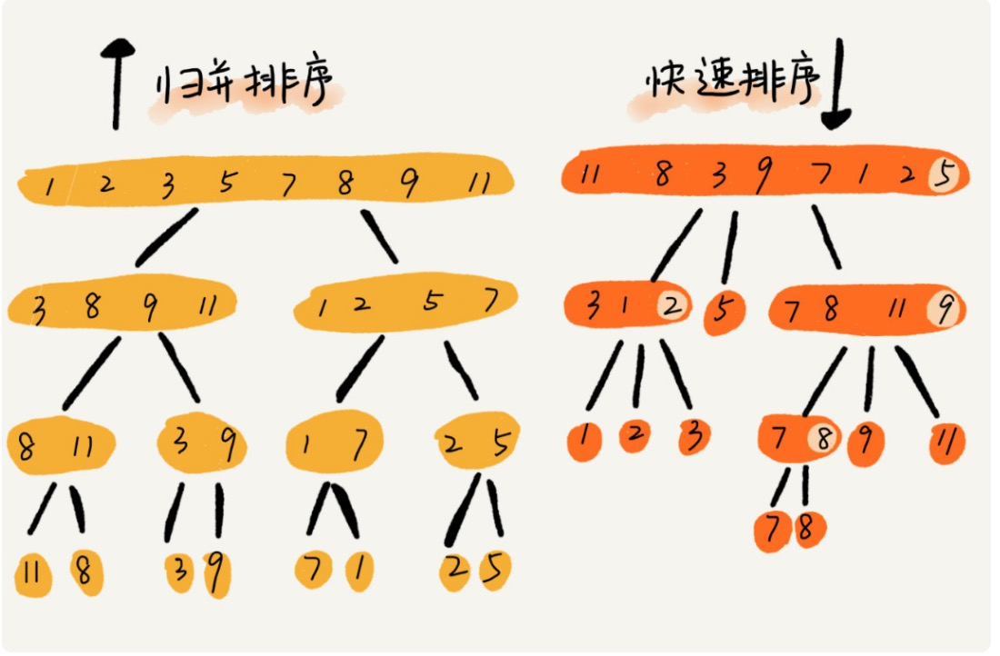

# 排序

学习方式
- 原理
- 实现
- 如何评价、分析一个排序算法

## 具体排序
- [x] [冒泡](https://zh.wikipedia.org/wiki/%E5%86%92%E6%B3%A1%E6%8E%92%E5%BA%8F)
- [x] [选择](https://zh.wikipedia.org/wiki/%E9%80%89%E6%8B%A9%E6%8E%92%E5%BA%8F)
- [x] [插入](https://zh.wikipedia.org/zh-hans/%E6%8F%92%E5%85%A5%E6%8E%92%E5%BA%8F)
- [x] [归并](https://zh.wikipedia.org/wiki/%E5%BD%92%E5%B9%B6%E6%8E%92%E5%BA%8F)
  - [ ] 用哨兵方式简化流程
- [ ] 希尔(可以视为插入排序的优化)
- [x] [快速](https://zh.wikipedia.org/wiki/%E5%BF%AB%E9%80%9F%E6%8E%92%E5%BA%8F)
- [ ] [基数](https://zh.wikipedia.org/wiki/%E5%9F%BA%E6%95%B0%E6%8E%92%E5%BA%8F)
- [x] [计数](https://zh.wikipedia.org/wiki/%E8%AE%A1%E6%95%B0%E6%8E%92%E5%BA%8F)
- [ ] 堆
- [x] [桶](https://zh.wikipedia.org/wiki/%E6%A1%B6%E6%8E%92%E5%BA%8F)
## 各种排序算法比较

|排序|时间复杂度|空间复杂度|是否原地| 是否基于比较 | 是否稳定| 思想|技巧| 其他|
|----|---|---|----|---|---|---|---|---|
|冒泡|O(n^2)||是|是|是||||
|插入|O(n^2)||是|是|是||||
|选择|O(n^2)||是|是|否||||
|归并|O(nlogn)|O(n)|否|是|是|分治思想|递归|归并排序的执行效率与要排序的原始数组的有序程度无关，所以其时间复杂度是非常稳定的|
|快排|O(nlogn)|O(1)|是|是|否|分治思想|递归||
||||||||||
|桶排序|O(N)k是数据范围|O(N+K)|否|否(线性)|是|归纳||对数据有要求|
|计数|O(N+K)|O(N+K)|否|(线性)|是|归纳||对数据有要求|
|基数|O(N*K)k是维度|O(N+K)|否|(线性)|是|||主要应用与数字类型数组|
## 问题解答

### 问题一 冒泡与插入时间复杂度一样，实际软件开发中为什么更倾向于使用插入排序？

因冒泡的数据交换比插入的数据交换步骤更多，如下

冒泡数据交换步骤

```go
p[i], p[j] = p[j], p[i]
```

插入排序数据交换步骤

```go
if (a[j] > value) { 
    a[j+1] = a[j]; // 数据移动
}
```

## 归并排序与快速排序区别与联系

### 相同点

- 都是采用分治思想



可以发现，归并排序的处理过程是由下到上的，先处理子问题，然后再合并。而快排正好相反，它的处理过程是由上到下的，先分区，然后再处理子问题。归并排序虽然是稳定的、时间复杂度为 O(nlogn) 的排序算法，但是它是非原地排序算法。我们前面讲过，归并之所以是非原地排序算法，主要原因是合并函数无法在原地执行。快速排序通过设计巧妙的原地分区函数，可以实现原地排序，解决了归并排序占用太多内存的问题。

## 桶、计数、基数三种线性排序区别与联系

## 感想

刷算法主要是理解实现算法时使用的思想，只要理解了这些，遇到问题时多想想这些思想应用就行，具体细节问题再根据场景具体处理。

## 可参考

[go 排序实现](https://www.bookstack.cn/read/For-learning-Go-Tutorial/src-chapter16-01.0.md)

[go 排序](http://www.topgoer.com/Go%E9%AB%98%E7%BA%A7/%E5%9F%BA%E6%95%B0%E6%8E%92%E5%BA%8F%E7%AE%97%E6%B3%95.html)

[十张动图带你搞懂排序算法](https://my.oschina.net/u/4113533/blog/4767548)